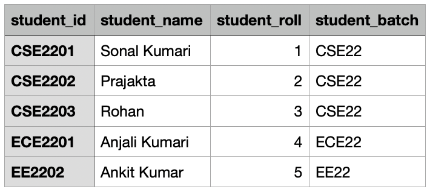
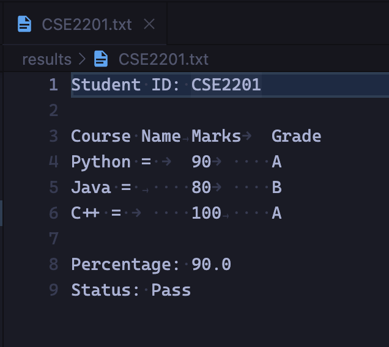
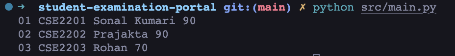

# Student Examination Portal

## Introduction

This is a simple student examination portal with student and their details about batch, department, course and examination marks. It consist of a database that stores all the values in csv files.

## Objective

The objective of this project is to develop a cli based application to manage student examination details. IT can create students, batches, courses, departments and add examinations results. It can also generate report cards for students. Some Graphical representation of the data is also provided. 

## Organization of the project

The project is divided into 6 modules and one main file to run the application.

1. Database - Creates the initial database and stores the data in csv files. It also contains function to read a particular csv file and return it as an array.

2. Student - It contains all the functions related to student. It can create a new student, delete a student, update a student details and generate report card for a student.

3. Course - It contains all the functions related to course. It can create a new course, view performance of all students in the course, show course statistics and generate a Histogram showing number of students in each grade.

4. Department - It contains all the functions related to department. It can create a new department, view all batches in a department, view average performance of all batches in the department, show department statistics and generate a Line plot graph showing Average percentage of all students for each batch.

5. Batch - It contains all the functions related to batch. It can create a new batch, view list of all students in a batch, view list of all courses taught in the batch, view complete performance of all students in a batch, Pie Chart of Percentage of all students.

6. Examination - It contains all the functions related to examination. It can enter marks of all students for a specific examination, view performance of all students in the examination, show examination statistics and generate a Scatter Plot of all marks obtained.

## Database Description

The database is divided into 4 csv files. The files are as follows:

1. student.csv - It contains the details of all the students. It has the following columns:

    1. Student ID
    2. Student Name
    3. Student Roll
    4. Student Batch

2. batch.csv - It contains the details of all the batches. It has the following columns:

    1. Batch ID
    2. Batch Name
    3. Department Name
    4. List of Courses
    5. List of Students

3. course.csv - It contains the details of all the courses. It has the following columns:

    1. Course ID
    2. Course Name
    3. Marks Obtained

4. department.csv - It contains the details of all the departments. It has the following columns:

    1. Department ID
    2. Department Name
    3. List of Batches

## Data Flow and E-R Diagrams

Each module has its function and every module uses database module to read and write data to the csv files. The data flow diagram is as follows:

# Output

When the application is started with the command `python3 src/main.py`, it will create a object of class `StudentExaminationPortal` which contains all the member functions of all the modules. It will then run all the function in the class as written in the `main.py` file. It contains a constructor which will create the database schema if it is not present and delete the old database folder.

The top functions that are called in the class will create the database and it will add the marks of the students in the examination with the `set_marks` member function as shown in the Sample database.

Then we have `generate_report_card` function which will create a directory `results` and will create a report card for student with student id as name of the file. The report card will contain Student ID with marks of all subject with grade and total percentage.

Then we have some of the functions to display the data of the students and their performance. The functions are as follows:

1. `view_course_performance` - It will display the performance of all the students in a particular course. When the function is called, it will ask for the course id and will display the marks of all the students in the course.

    

2. `view_course_statistics` - It will display the statistics of all the students in a particular course. When the function is called, it will ask for the course id and will display the statistics of all the students in the course.

    

3. `view_batch_performance` - It will display the performance of all the students in a particular batch. When the function is called, it will ask for the batch id and will display the marks of all the students in the batch.

    

4. `get_percent_chart` - It will display the Pie Chart of all the students in a particular batch. When the function is called, it will ask for the batch id and will display the Pie Chart of all the students in the batch.

    

5. `view_department_performance` - It will display the performance of all the students in a particular department. When the function is called, it will ask for the department id and will display the marks of all the students in the department.

    

6. `view_department_statistics` - Show department statistics in a Line plot graph with average percentage of all students for each batch. X axis - Batch Name, Y axis – Average Percentage

    